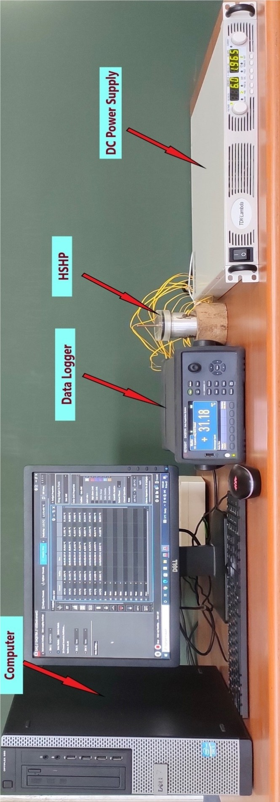
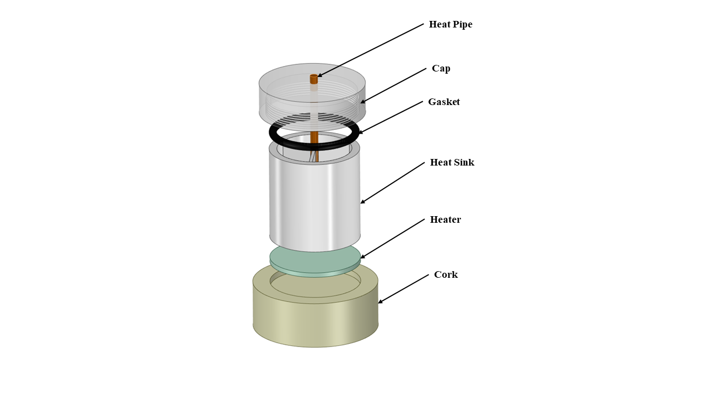
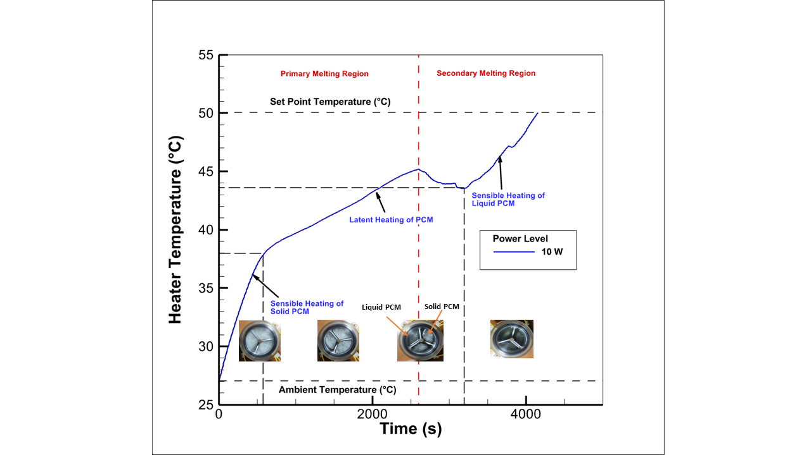
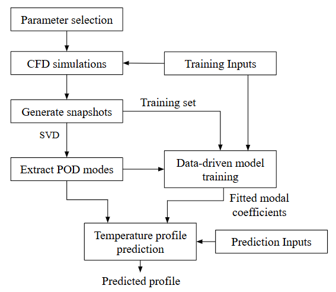
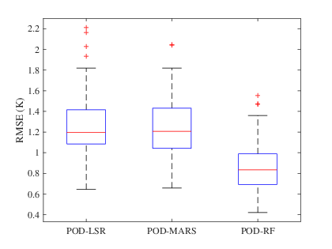
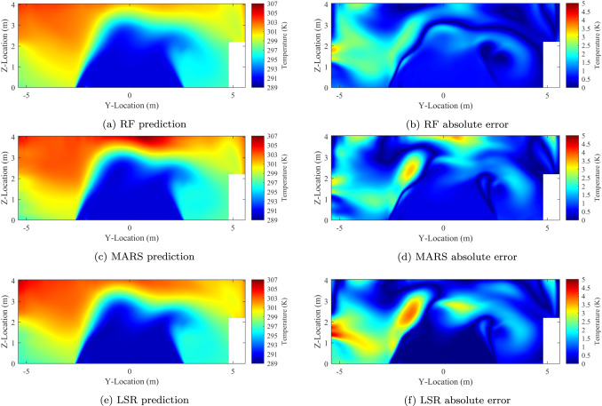

# Research | Shailesh Kushwaha

My research lies at the intersection of **experimental heat transfer, computational fluid dynamics, reduced-order modeling, and scientific machine learning**. I develop and investigate thermal management systems through a combination of experimental methods, high-fidelity numerical simulations, and data-driven computational techniques.

My broader objective is to develop accurate and computationally efficient approaches for thermal analysis, prediction, and optimization.

---

# Research Themes

## 1. Experimental Thermal Engineering

My experimental work focuses on the thermal management of electronic systems and the development of experimental facilities for investigating advanced cooling technologies.

### Electronics Cooling

During my master's research, I designed and fabricated an **in-house experimental facility** for investigating PCM-based heat sinks. The experimental work included different fin configurations and a heat-pipe-coupled three-fin heat sink.

The study investigated the charging and discharging behavior of PCM-based heat sinks and evaluated their thermal performance under different operating conditions. The heat-pipe-coupled configuration demonstrated improved performance compared with the other configurations investigated.

**Experimental facility:** In-house experimental setup developed for the thermal characterization of PCM-based heat sinks.

**Heat-sink configuration:** Schematic of the heat-pipe-coupled three-fin heat sink used in the experimental investigation.

**Experimental results:** Temperature evolution of the PCM-based heat sink at a 10 W heat input, illustrating the different stages of PCM heating and phase change.

**Key areas:**

- PCM-based heat sinks
- Heat pipe-assisted cooling
- Thermal performance characterization
- Experimental heat transfer
- Thermal management of electronic components

### Immersion Cooling

I am also developing an **in-house experimental facility for single-phase immersion cooling of data center servers**, with the aim of investigating alternative cooling strategies for high-density computing systems.

---

## 2. Computational Thermal Engineering

Computational Fluid Dynamics forms an important component of my research.

My work involves developing computational models for thermal management systems and using experimental measurements to establish confidence in the numerical predictions.

### Data Center Cooling

My doctoral research includes the development of high-fidelity CFD models for **air-cooled data centers**, with emphasis on airflow distribution and temperature-field prediction.

The CFD models provide high-dimensional temperature fields that can subsequently be used for reduced-order modeling and rapid thermal prediction.

The published data-center study uses a full-scale CFD model and investigates temperature-field prediction under varying server power, airflow, and cooling-unit operating conditions.

---

## 3. Reduced-Order Modeling

High-fidelity CFD simulations can require substantial computational resources, particularly when many operating conditions must be evaluated.

My current research therefore investigates **data-driven reduced-order modeling** to retain the dominant thermal behavior while substantially reducing computational cost.

### POD-Based Reduced-Order Modeling

I use **Proper Orthogonal Decomposition (POD)** to extract dominant spatial structures from high-dimensional temperature fields.

The resulting reduced-order representation is combined with machine-learning models to predict the POD modal coefficients for new operating conditions.

In my published work, the POD-RF framework was evaluated using **714 CFD simulations**, including **600 training cases and 114 independent test cases**.

The POD-RF model achieved an MAE of **0.621 K**, RMSE of **0.831 K**, and $(R^2 = 0.958)$ over the independent test dataset.

Most importantly, the reduced-order model reduced the prediction time from approximately **5 hours for a high-fidelity CFD simulation to less than one second** per operating condition.

**Reduced-order modeling framework:** CFD data generation, POD mode extraction, model training, and prediction.

**Model validation:** Comparison of predicted and CFD mean temperatures for POD-LSR, POD-MARS, and POD-RF.

**Spatial temperature prediction** Temperature field prediction using POD-RF, POD-MARS, and POD-LSR.

---

## 4. Scientific Machine Learning

My research increasingly focuses on the integration of **machine learning with physics-based thermal modeling**.

My current work has explored machine-learning-assisted prediction of POD modal coefficients using regression techniques such as:

- Random Forest
- Multivariate Adaptive Regression Splines (MARS)
- Least-Squares Regression (LSR)

The objective is not simply to replace the CFD model with a black-box machine-learning model, but to combine **physics-based dimensionality reduction through POD** with machine learning for efficient prediction.

This provides a framework in which the dominant spatial structures of the thermal field remain interpretable while the relationship between operating conditions and modal coefficients is learned from data.

---

## 5. Physics-Informed Machine Learning

A future direction of my research is the development of **Physics-Informed Neural Networks (PINNs)** and related physics-informed machine-learning approaches.

I am particularly interested in investigating whether physics-informed models can provide computationally efficient alternatives or complements to conventional CFD for selected thermal-fluid problems.

Potential directions include:

- Physics-informed thermal-field prediction
- Hybrid CFD–machine-learning models
- Physics-informed reduced-order models
- Fast surrogate models for thermal systems
- Data-efficient learning using governing equations

---

# Research Projects

## POD-Based Reduced-Order Modeling for Air-Cooled Data Centers

**Status:** Published / Completed

Development of a data-driven POD framework combined with Random Forest regression for rapid prediction of temperature fields in air-cooled data centers.

[Read the publication →](publications.qmd)

---

## Experimental Facility for Single-Phase Immersion Cooling

**Status:** Ongoing

Design and development of an experimental facility for investigating single-phase immersion cooling of data center servers.

---

## CFD Automation and Scientific Computing

**Status:** Ongoing

Development of automated computational workflows for CFD simulations using Python and scientific computing tools, with the objective of improving simulation efficiency and research productivity.

---

## Physics-Informed Machine Learning for Thermal Engineering

**Status:** Future Research Direction

Investigation of PINNs and related scientific machine-learning approaches for efficient thermal-fluid simulation and prediction.

---

# Research Interests

- Experimental Heat Transfer
- Thermal Management of Electronic Systems
- Data Center Cooling
- Computational Fluid Dynamics
- Reduced-Order Modeling
- Scientific Machine Learning
- Physics-Informed Machine Learning